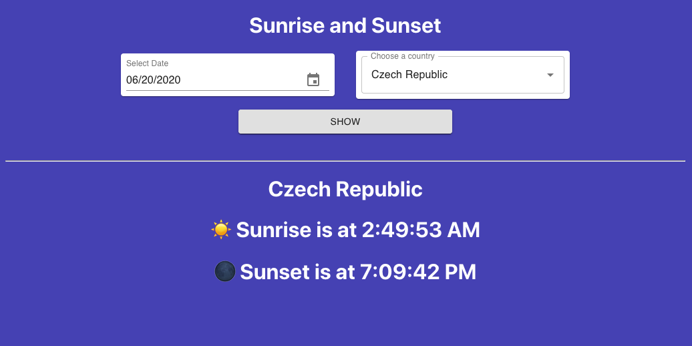

# Sunrise !

Responsive App for view sunrise and sunset by selected date and Country.

- Interval of date is stted on - from `2019-01-01` to `2020-06-20` (can be changed in config file)

- For create this little app was used Docker, React, yarn and TypeScript.

- All times are in UTC and summer time adjustments are not included .

# Use

For running develop application run this command:

    $ docker-compose -f docker-compose.dev.yaml up

# View

# Sources

- Api for list of countries - [https://restcountries.eu/](https://restcountries.eu/)
- Api for sunset and sunrise time - [https://sunrise-sunset.org/api](https://sunrise-sunset.org/api)
